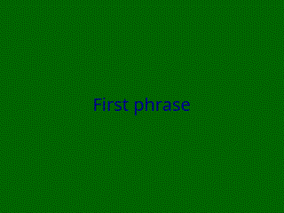

# GifMaker

A Rust command-line tool that creates animated GIFs from text with custom backgrounds and transitions.

## Description

GifMaker creates animated GIFs with two text phrases that fade in with smooth transitions. The tool generates a colored background video and overlays your text with configurable fonts, colors, and transitions.


## Example



## Dependencies

### System Dependencies

**FFmpeg** (version 6.1.1 or newer with the following features):
- `libfreetype` - for text rendering
- `libfontconfig` - for font configuration
- `libass` - for advanced subtitle support
- Color video generation (`color` filter)
- Text overlay (`drawtext` filter)
- Transition effects (`xfade` filter)

### Required FFmpeg Configuration

Ensure your FFmpeg installation includes:
```
--enable-libfreetype
--enable-libfontconfig
--enable-libass
--enable-filter=drawtext
--enable-filter=xfade
--enable-filter=color
```

To check your FFmpeg configuration:
```bash
ffmpeg -version | grep configuration
```

### Rust Dependencies

- `dotenv = "0.15.0"` - for environment variable configuration

## Installation

1. Clone the repository:
```bash
git clone <repository-url>
cd gifmaker
```

2. Install FFmpeg (Ubuntu/Debian):
```bash
sudo apt update
sudo apt install ffmpeg
```

3. Build the project:
```bash
cargo build --release
```

## Configuration

Create a `.env` file in the project root with the following variables:

```env
# Background colors (ffmpeg -colors for available options)
F_COLOR=DarkGreen
S_COLOR=DarkBlue

# Transition effects (ffmpeg --help filter=xfade for options)
TRANSITION=vertclose

# Animation duration in seconds
DURATION=5

# Font settings
FONT_SIZE=20

# Maximum characters per line (text wrapping)
LINE_LENGTH=20
```

### Available Options

**Colors**: Use any FFmpeg color name or hex value. Run `ffmpeg -colors` for a complete list.

**Transitions**: Available transition effects include:
- `fade` - Fade transition
- `wipe` - Wipe transition
- `vertclose` - Vertical close transition
- `horizclose` - Horizontal close transition
- And many more (run `ffmpeg --help filter=xfade`)

## Usage

1. **Run the application**:
```bash
./target/release/gifmaker
```

2. **Enter your first text phrase** when prompted.

3. **Enter your second text phrase** when prompted.

4. The application will:
   - Generate a colored background video
   - Add your text overlay with the configured transition
   - Create the final GIF in the `gif/` directory
   - Automatically open the result with your system's default viewer

### Command Line Options

- `--help` - Display help message
- `--restore-config` - Restore default configuration

## Output

The generated GIF will be saved as:
```
gif/output.gif
```

## Example

```bash
$ ./gifmaker
Введите первую фразу:
Hello World! This is my first phrase
Введите вторую фразу:
And this is the second phrase with more text

Ваш файл сохранен в: /your/script/location/gifmaker/gif/output.gif
```

## Project Structure

```
gifmaker/
├── src/
│   ├── main.rs          # Main application logic
│   ├── gifconfig.rs     # Configuration handling
│   ├── utils.rs         # Utility functions
│   ├── service.rs       # Service functions
│   └── errors.rs        # Error handling
├── .env                 # Environment variables
├── Cargo.toml           # Rust dependencies
├── gif/                 # Output directory
└── README.md            # This file
```

## Error Handling

The application includes comprehensive error handling for:
- Missing FFmpeg installation
- Invalid configuration values
- File I/O operations
- Text processing errors

## Contributing

1. Fork the repository
2. Create a feature branch
3. Make your changes
4. Test thoroughly
5. Submit a pull request
